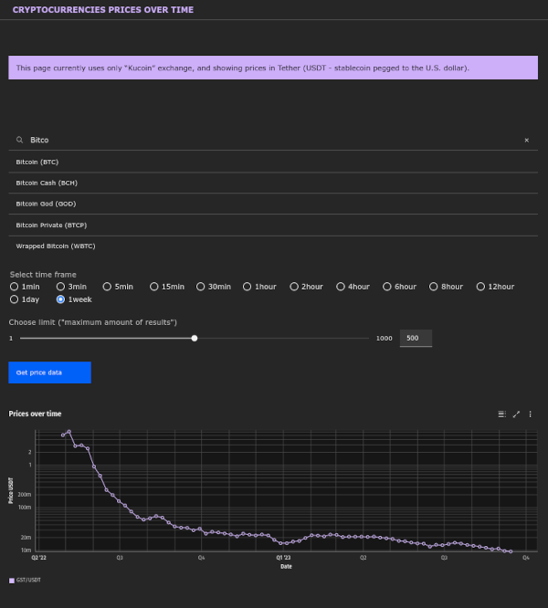

# 🪧 Cryptocurrencies prices over time

## 📋 About

⚡ Current branch - **aftersubmit** is my try to improve code and probably add/modify functionality after **master** branch was submitted when applying for IBM internship.

This is one page React application with functionality to search/select cryptocurrency and view it's prices over time.

It has Node.js (Express.js) backend to log user actions (searched cryptocurrencies) and act as api middleware for CCXT library methods.

Styled using Carbon Design React components and minimal custom SASS rules.



## Functionality, features

Front-End (**React**)

- Responsive
- Search. Start cryptocurrency Search by typing and select from dropdown matches.
- Radio inputs for valid timeframes;
- Slider input to set limit for returned results (time points in graph);
- Renders line chart to visualize price changes over time;

Back-End (**Node.js with Express.js + Mongo.db**)

- Logs searched and selected currencies to console and Mongo.db (if db url string provided in env).
- Using CCXT library to get info about cryptocurrencies. Acting as middleware API between front-end and external apis.
- Using only one default exchange (kucoin) and returning prices in USDT only.

### 🏁 Getting started locally

**Must have [Node.js](https://nodejs.org), npm** installed

**If want to use [Mongo db](https://account.mongodb.com/account/login)** , make sure to have cluster created with database named 'crypto',add server ip address to allowed networks in Atlas. Copy cluster connection string to .env file (step 2).

1. Clone the repo

2. Add .env file with .envexample content in server directory. And modify DATABASE_URL variable with your own Mongo db connection string.

3. Add .env file with .envexample content in client directory.

4. Install client NPM packages : run below command in client directory.

   ```sh
   npm install
   ```

5. Install server NPM packages : run below command in server directory

   ```sh
   npm install
   ```

6. Go into server directory and

   - **TO START SERVER** IN DEVELOPMENT mode with nodemon (will run on [http://localhost:5000](http://localhost:5000)) : run below command:

   ```sh
   npm run dev
   ```

   - OR **TO START SERVER** PRODUCION mode. Change NODE_ENV (.env file in server directory) to 'production' and run:

   ```sh
   npm start
   ```

7. Go into client directory and

   - **TO START REACT** IN DEVELOPMENT mode (will run on [http://localhost:5173/](http://localhost:5173/)) : run below command:

   ```sh
   npm run dev
   ```

   - OR **TO BUILD REACT APPLICATION** for PRODUCION : run bellow command:

   ```sh
   npm run build
   ```

   - **TO START REACT BUILD PREVIEW** locally (will run on [http://localhost:4173/](http://localhost:4173/)) change CLIENT variable in server .env to have correct port for client, restart server and run below command in client directory:

   ```sh
   npm run preview
   ```

### Backend API description:

Returns response with http status code and json object:

- **type**: 'success', 'failure' (for client errors) or 'error' (for server errors)
- **message**: error message or returned object description;
- **data**: requested or endpoint data;

**GET** Endpoints:

- **/** Return links to github repository (documentation) and github issues;
- **/api/currencies** Returns sorted array of available currencies in exchange. Single currency is an object with id, code, name, displayName;

- **/api/timeframes** Returns array of available timeframes for exchange. They will be used when getting data for charts. Every timeframe is an object with key and text;

- **/api/price-data** Requires url query parameters: currency, timeframe, limit;

#### [🪲Link to issues ](https://github.com/codevivi/cryptocurrencies-prices-over-time/issues)
